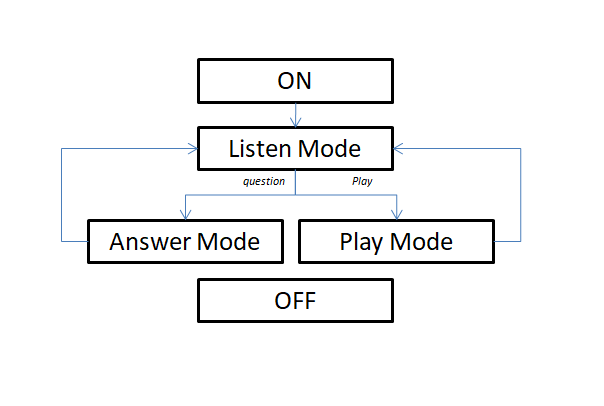

.. AmazonEcho documentation master file, created by
   sphinx-quickstart on Thu Mar  3 20:02:32 2022.
   You can adapt this file completely to your liking, but it should at least
   contain the root `toctree` directive.

Welcome to AmazonEcho's documentation!
======================================

:alt: High level overview of Amazon echo program

.. automodule:: txt_to_speech
    :members: text_to_speech

.. automodule:: answer_service
    :members: answer_mode

.. automodule:: database_entry
    :members:

.. automodule:: database_retriv
    :members:

.. automodule:: listening_service
    :members:

.. automodule:: play_service
    :members:

.. automodule:: main
    :members:

.. toctree::
   :maxdepth: 2
   :caption: Contents:

Indices and tables
==================

* :ref:`genindex`
* :ref:`modindex`
* :ref:`search`
